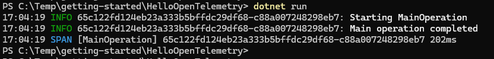

# Hello World - Adding Traces

In this tutorial, you'll add distributed tracing to your console application. Traces help you understand the flow of requests through your application and identify performance bottlenecks.

## What are Traces?

A trace represents the journey of a request through your application. It consists of one or more spans, where each span represents a unit of work. Traces help you:

- Understand the flow of execution in your application
- Identify performance bottlenecks
- Track distributed operations across services
- Correlate logs with specific operations

Standard W3C Trace IDs are automatically sent by .NET in HTTP requests, allowing distributed trace correlation by default.

## Update Your Application

Starting from the previous tutorial (or create a new console application following the same steps), update your `Program.cs`:

```csharp
using System.Diagnostics;
using Essential.OpenTelemetry;
using Microsoft.Extensions.DependencyInjection;
using Microsoft.Extensions.Hosting;
using Microsoft.Extensions.Logging;
using OpenTelemetry.Trace;

const string ServiceName = "HelloOpenTelemetry";

// Create an ActivitySource for tracing
var activitySource = new ActivitySource(ServiceName);

// Create the application host with OpenTelemetry
var builder = Host.CreateApplicationBuilder(args);

// Configure OpenTelemetry with both logging and tracing
builder.Logging.ClearProviders();
builder
    .Services.AddOpenTelemetry()
    .WithLogging(logging =>
    {
        logging.AddColoredConsoleExporter();
    })
    .WithTracing(tracing =>
    {
        tracing.AddSource(ServiceName).AddColoredConsoleExporter();
    });

var host = builder.Build();

// Get services
var logger = host.Services.GetRequiredService<ILogger<Program>>();
var tracerProvider = host.Services.GetRequiredService<TracerProvider>();

// Create a trace
using (var activity = activitySource.StartActivity("MainOperation"))
{
    logger.LogInformation("Starting {Name}", "MainOperation");

    // Simulate some work
    Thread.Sleep(100);

    logger.LogInformation("Main operation completed");
}

// Force flush to ensure all telemetry is exported before exit
tracerProvider.ForceFlush();
```

## Run the Application

Build and run your application:

```powershell
dotnet run
```

You should see output similar to this:



## Understanding the Code

### 1. Creating an ActivitySource

```csharp
const string ServiceName = "HelloOpenTelemetry";
var activitySource = new ActivitySource(ServiceName);
```

An `ActivitySource` is used to create activities (spans). The service name identifies your application in the telemetry data.

### 2. Configuring Tracing

```csharp
.WithTracing(tracing =>
{
    tracing.AddSource(ServiceName).AddColoredConsoleExporter();
})
```

- `WithTracing()` configures OpenTelemetry tracing
- `AddSource(ServiceName)` tells OpenTelemetry to collect activities from your ActivitySource
- `AddColoredConsoleExporter()` adds the colored console exporter for traces

**NOTE:** You only need to create your own activity source if you want to create custom activities. Many existing components have automatically instrumented activities, such as ASP.NET, Entity Framework, and other system components.

### 3. Creating an Activity

```csharp
using (var activity = activitySource.StartActivity("MainOperation"))
{
    // Your code here
}
```

The `StartActivity()` method creates a new activity (span). The `using` statement ensures the activity is properly ended when the block completes. Activities automatically capture:

- Start and end times
- Duration
- A unique trace ID (shared across related activities)
- A unique span ID (unique to this activity)

### 4. Flushing Telemetry

```csharp
tracerProvider.ForceFlush();
```

This ensures all telemetry is exported before the application exits. Without this, some telemetry might be lost in short-lived applications.

## Understanding Trace and Span IDs

When you run the application, you'll notice the log messages and span have the same trace ID. This correlation allows you to:

- See all logs that occurred during a particular trace
- Understand the context in which log messages were generated
- Track requests across multiple services (in distributed systems)

The format is typically: `[trace-id]-[span-id]`

---

**Next:** [Hello World - ASP.NET Core](HelloWorld3-AspNetCore.md)

[Home](../README.md) | [Getting Started](./Getting-Started.md) | [Logging Levels](./Logging-Levels.md) | [Event IDs](./Event-Ids.md) | [Performance Testing](./Performance.md)
