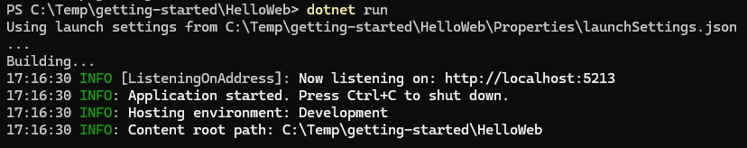
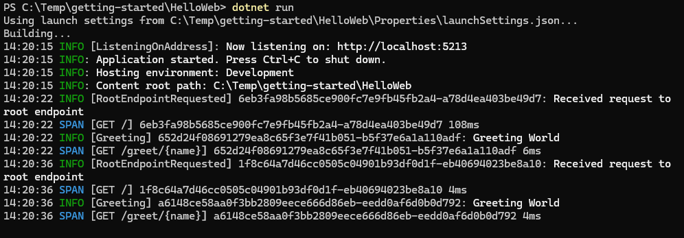

# Hello World - ASP.NET Core

In this tutorial, you'll create an ASP.NET Core web application with OpenTelemetry. You'll discover that ASP.NET Core automatically creates traces for HTTP requests, making it easy to observe your web application.

## Create a New Web Application

Open a terminal or command prompt and create a new web application:

```powershell
dotnet new web -n HelloWeb
cd HelloWeb
```

## Install Required Packages

Install the necessary NuGet packages:

```powershell
dotnet add package OpenTelemetry.Extensions.Hosting
dotnet add package OpenTelemetry.Instrumentation.AspNetCore
dotnet add package Essential.OpenTelemetry.Exporter.ColoredConsole
```

These packages provide:

- **OpenTelemetry.Extensions.Hosting**: OpenTelemetry integration with the .NET hosting model
- **OpenTelemetry.Instrumentation.AspNetCore**: ASP.NET Core instrumentation library
- **Essential.OpenTelemetry.Exporter.ColoredConsole**: The colored console exporter for viewing telemetry

## Write the Code

Replace the contents of `Program.cs` with the following code:

```csharp
using Essential.OpenTelemetry;
using Microsoft.Extensions.Logging;
using OpenTelemetry.Trace;

var builder = WebApplication.CreateBuilder(args);

// Configure OpenTelemetry with logging and tracing
builder.Logging.ClearProviders();
builder
    .Services.AddOpenTelemetry()
    .WithLogging(logging =>
    {
        logging.AddColoredConsoleExporter();
    })
    .WithTracing(tracing =>
    {
        // ASP.NET Core instrumentation automatically creates spans for HTTP requests
        tracing.AddAspNetCoreInstrumentation().AddColoredConsoleExporter();
    });

var app = builder.Build();

// Define a simple endpoint
app.MapGet("/", (ILogger<Program> logger) =>
{
    logger.RootEndpointRequested();
    return "Hello from OpenTelemetry!";
});

// Define another endpoint with a parameter
app.MapGet("/greet/{name}", (string name, ILogger<Program> logger) =>
{
    logger.Greeting(name);
    return $"Hello, {name}!";
});

app.Run();

// Source-generated log methods
internal static partial class LoggerExtensions
{
    [LoggerMessage(Level = LogLevel.Information, EventId = 1200, Message = "Received request to root endpoint")]
    public static partial void RootEndpointRequested(this ILogger logger);

    [LoggerMessage(Level = LogLevel.Information, EventId = 1500, Message = "Greeting {Name}")]
    public static partial void Greeting(this ILogger logger, string name);
}
```

## Run the Application

Build and run your application:

```powershell
dotnet run
```

You should see output indicating the application is listening:



## Test the Application

Open a web browser or use curl to make requests, copying the port shown on start up (5213 in the example above):

```powershell
# In another terminal
curl http://localhost:5213
curl http://localhost:5213/greet/World
```

In your application console, you should see output similar to:



Note that spans (and trace IDs) are already provided by the ASP.NET core instrumentation.

## Understanding the Code

### 1. ASP.NET Core Instrumentation

```csharp
tracing.AddAspNetCoreInstrumentation().AddColoredConsoleExporter();
```

The `AddAspNetCoreInstrumentation()` method automatically instruments your ASP.NET Core application. It creates a span for every HTTP request, capturing:

- HTTP method (GET, POST, etc.)
- URL path
- Status code
- Response time
- Request headers (optionally)

You don't need to manually create activities for HTTP requests – they're created automatically!

### 2. Logging Within Request Context

```csharp
app.MapGet("/", (ILogger<Program> logger) =>
{
    logger.RootEndpointRequested();
    return "Hello from OpenTelemetry!";
});
```

When you log messages during HTTP request processing, they automatically include the trace ID and span ID of the current HTTP request. This makes it easy to correlate logs with specific requests.

Note that this example uses source-generated log methods via the `[LoggerMessage]` attribute, as covered in [Adding Traces](HelloWorld2-Traces.md).

### 3. Minimal API Pattern

This example uses the minimal API pattern introduced in .NET 6. The `MapGet` method:

- Defines an HTTP endpoint
- Uses dependency injection to provide the logger
- Returns a response

## Understanding ASP.NET Core Instrumentation

The ASP.NET Core instrumentation library provides many benefits automatically:

- **Zero-code tracing**: HTTP requests are traced without manual instrumentation
- **Consistent span naming**: All HTTP spans follow a consistent naming pattern
- **Standard attributes**: HTTP method, URL, status codes are captured automatically
- **Error tracking**: Failed requests are marked as errors in the trace data

---

**Next:** [Adding Metrics](HelloWorld4-Metrics.md)

[Home](../README.md) | [Getting Started](./Getting-Started.md) | [Logging Levels](./Logging-Levels.md) | [Event IDs](./Event-Ids.md) | [Performance Testing](./Performance.md)
