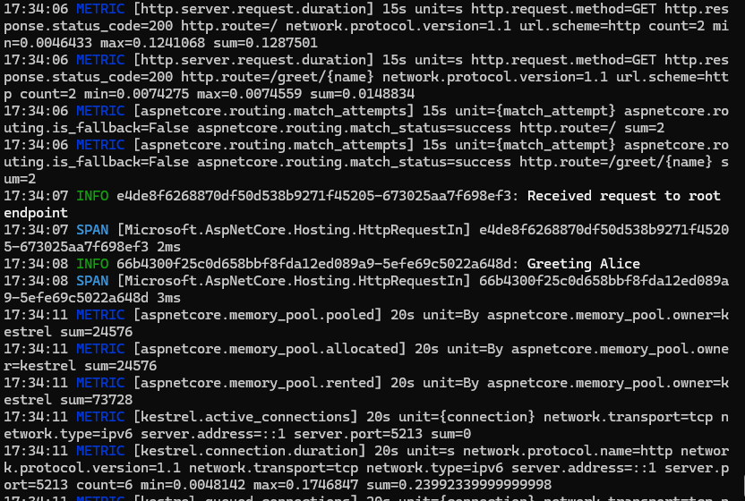

# Hello World - Viewing Metrics

In this tutorial, you'll see how ASP.NET Core automatically generates metrics and how to export them using the Essential OpenTelemetry colored console exporter.

## What are Metrics?

Metrics are numerical measurements that help you understand your application's behavior and performance over time. ASP.NET Core automatically tracks metrics such as:

- Request counts
- Request durations
- Active requests
- Failed requests

## Update Your Web Application

Starting from the previous ASP.NET Core tutorial, update your `Program.cs` to add metrics collection:

```csharp
using Essential.OpenTelemetry;
using Microsoft.Extensions.Logging;
using OpenTelemetry.Metrics;
using OpenTelemetry.Trace;

var builder = WebApplication.CreateBuilder(args);

// Configure OpenTelemetry with logging, tracing, and metrics
builder.Logging.ClearProviders();
builder
    .Services.AddOpenTelemetry()
    .WithLogging(logging =>
    {
        logging.AddColoredConsoleExporter();
    })
    .WithTracing(tracing =>
    {
        tracing.AddAspNetCoreInstrumentation().AddColoredConsoleExporter();
    })
    .WithMetrics(metrics =>
    {
        // Collect metrics from ASP.NET Core
        metrics
            .AddAspNetCoreInstrumentation()
            // Keep instruments that start with "http.server.", and drop others
            .AddView(instrument =>
                instrument.Name.StartsWith("http.server.", StringComparison.Ordinal)
                    ? null : MetricStreamConfiguration.Drop)
            .AddColoredConsoleExporter(options => { }, exportIntervalMilliseconds: 5000);
    });

var app = builder.Build();

// Define a simple endpoint
app.MapGet("/", (ILogger<Program> logger) =>
{
    logger.RootEndpointRequested();
    return "Hello from OpenTelemetry with Metrics!";
});

// Define another endpoint
app.MapGet("/greet/{name}", (string name, ILogger<Program> logger) =>
{
    logger.Greeting(name);
    return $"Hello, {name}!";
});

app.Run();

// Source-generated log methods
internal static partial class LoggerExtensions
{
    [LoggerMessage(Level = LogLevel.Information, EventId = 1200, Message = "Received request to root endpoint")]
    public static partial void RootEndpointRequested(this ILogger logger);

    [LoggerMessage(Level = LogLevel.Information, EventId = 1500, Message = "Greeting {Name}")]
    public static partial void Greeting(this ILogger logger, string name);
}
```

## Run the Application

Build and run your application:

```bash
dotnet run
```

## Test the Application

Make several requests to generate metrics, copying the port shown on start up:

```bash
# In another terminal, make multiple requests
curl http://localhost:5213
curl http://localhost:5213/greet/Alice
curl http://localhost:5213/greet/Bob
curl http://localhost:5213
curl http://localhost:5213/greet/Charlie
```

Every 5 seconds, you should see metrics output in the console showing HTTP request metrics:



Note that outputting individual metric counters to the console may not be very interesting — you generally want to send them to an observability platform includes a time series database for statistical analysis of the metrics, such as [Prometheus](https://prometheus.io/).

## Understanding the Code

### 1. Adding Metrics Collection

```csharp
.WithMetrics(metrics =>
{
    metrics
        .AddAspNetCoreInstrumentation()
        // Keep instruments that start with "http.server.", and drop others
        .AddView(instrument =>
            instrument.Name.StartsWith("http.server.", StringComparison.Ordinal)
                ? null : MetricStreamConfiguration.Drop)
        .AddColoredConsoleExporter(options => { }, exportIntervalMilliseconds: 5000);
})
```

- `WithMetrics()` configures OpenTelemetry metrics collection
- `AddView()` filters the metrics to only include those starting with `http.server.` (by returning the default null), and dropping all others
- `AddAspNetCoreInstrumentation()` automatically collects HTTP metrics from ASP.NET Core
- `AddColoredConsoleExporter()` exports metrics to the console every 5 seconds

### 2. Automatic Metric Collection

ASP.NET Core automatically tracks:

- **http.server.request.duration**: How long each request takes
- **http.server.active_requests**: Number of requests currently being processed
- **Request attributes**: HTTP method, status code, route

You don't need to write any code to instrument individual requests – the metrics are collected automatically!

### 3. Metric Export Interval

The metrics are exported every 5 seconds (5000 milliseconds). This is configured in the `exportIntervalMilliseconds` parameter.

## Understanding the Metrics

When you make multiple requests, you'll see metrics grouped by route and HTTP method:

- **time span**: Duration the metric applies to (up to the timestamp)
- **count**: Total number of requests to this endpoint
- **min/max**: Minimum and maximum request durations
- **http.route**: The route pattern (e.g., `/`, `/greet/{name}`)
- **http.response.status_code**: HTTP status code (200 for success)

Time span may be either cumulative or additive, and is best processed by an observability platform.

This data helps you:

- Identify which endpoints are most frequently used
- Spot performance issues (endpoints with high max duration)
- Monitor application health (status codes, active requests)

Examining the output above you can see the `duration` metrics for the `route=/greet/{name}`, having `count=1` for the first 10 seconds, then increasing to 2, then 3, as more requests are received.

From the 15s mark there are also metrics for `route=/`.

In this case the 15s metrics overlap with the earlier metric periods, so you would need to take the difference for that time period.

## Next Steps

Now that you understand the basics, consider installing and connecting to a local observability backends like:

- Jaeger (for traces)
- Prometheus (for metrics)
- Grafana Loki (for logs)
- Aspire Dashboard
- Seq

You can then deploy to one of dozens of production scale observability [vendors that support OpenTelemetry](https://opentelemetry.io/ecosystem/vendors/), including:

- Azure Monitor
- AWS X-Ray
- Google Cloud Trace
- Splunk
- NewRelic
- Elastic
- AppDynamics
- Honeycomb
- SolarWinds
- and many others

---

**Next:** Add the ColoredConsoleExporter to your project, and join the OpenTelemetry ecosystem.

[Home](../README.md) | [Getting Started](./Getting-Started.md) | [Logging Levels](./Logging-Levels.md) | [Event IDs](./Event-Ids.md) | [Performance Testing](./Performance.md)
